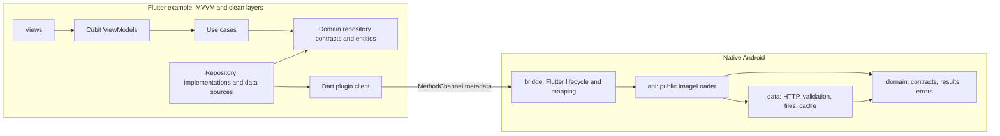

# image_cache_plugin

`image_cache_plugin` is an Android-only Flutter plugin and example application
for a native image downloading and caching assignment. A Kotlin loader stores
validated images in a persistent disk cache, exposes Kotlin and Java APIs, and
bridges file metadata to Flutter for file-backed rendering. The example is a
responsive gallery organized with MVVM and clean dependency boundaries.


## Platform and prerequisites

- Android only; iOS, web, desktop, and other Flutter platforms are unsupported.
- Flutter 3.41.9 stable with Dart 3.11.5.
- Android SDK 36.
- Java 17.
- An Android device or emulator for running the example.

The example targets Android SDK 36 and supports Android API 24 and newer.

## Run and verify

All verification is local. This repository does not use GitHub Actions.

From the repository root:

```bash
flutter pub get
dart format --output=none --set-exit-if-changed .
flutter analyze
flutter test
flutter pub publish --dry-run
```

From `example/`:

```bash
flutter pub get
flutter analyze
flutter test
flutter run
flutter build apk --debug
flutter build apk --release
```

Run the native unit tests from `example/android/`:

```bash
./gradlew testDebugUnitTest
```

## Dart API

Import the package and use `ImageCachePlugin` for explicit cache operations.
`loadImage` returns the native path, source, and successful commit timestamp.

```dart
import 'package:flutter/material.dart';
import 'package:image_cache_plugin/image_cache_plugin.dart';

final cache = ImageCachePlugin();
final CachedImageFile image = await cache.loadImage(
  'https://example.com/image.jpg',
);

debugPrint('${image.path} ${image.source} ${image.cachedAtMilliseconds}');
await cache.evictImage('https://example.com/image.jpg');
await cache.clearCache();
```

`NativeCachedImage` loads through the same client and renders the returned file
with `FileImage`. It displays `placeholder` while loading and delegates loading
or decoding failures to `errorBuilder`.

```dart
NativeCachedImage(
  url: 'https://example.com/image.jpg',
  width: 240,
  height: 180,
  fit: BoxFit.cover,
  placeholder: const Center(child: CircularProgressIndicator()),
  errorBuilder: (context, error) => const Center(
    child: Icon(Icons.broken_image_outlined),
  ),
)
```

The injectable `ImageCacheClient` boundary supports alternate hosts and widget
tests without exposing MethodChannel details to the UI.

## Native Android API

The native facade is
`com.tieorange.image_cache_plugin.api.ImageLoader`. Retain one loader for the
owning lifecycle and call `close()` on the Android main thread when that
lifecycle ends.

Kotlin suspend operations can run from a lifecycle-owned coroutine. Target
registration, target replacement, and `close()` must run on the main thread;
target updates are also delivered there.

```kotlin
val loader = ImageLoader(this)

lifecycleScope.launch {
    val cached = loader.load("https://example.com/image.jpg")
    loader.evict("https://example.com/image.jpg")
    loader.clear()
}

val request = loader.loadInto(
    url = "https://example.com/image.jpg",
    target = imageView,
    placeholderResource = R.drawable.placeholder,
)

override fun onDestroy() {
    request.cancel()
    loader.close()
    super.onDestroy()
}
```

Java callers use callbacks rather than Kotlin continuations. Callback delivery
and `ImageView` updates occur on the main thread. `loadInto` and `close()` must
be called on the main thread.

```java
ImageLoader loader = new ImageLoader(this);

ImageRequest fileRequest = loader.load(url, new ImageLoaderCallback() {
  @Override public void onSuccess(CachedImageFile result) {}
  @Override public void onError(Exception error) {}
});

ImageRequest targetRequest = loader.loadInto(
    url,
    imageView,
    R.drawable.placeholder,
    new ImageTargetCallback() {
      @Override public void onSuccess(CachedImageFile result) {}
      @Override public void onError(Exception error) {}
    }
);

fileRequest.cancel();
targetRequest.cancel();
loader.close();
```

Reusing an `ImageView` supersedes its previous request. Each callback or target
load returns an `ImageRequest` that can be cancelled.

## Architecture

Dependencies point inward. Flutter embedding types are confined to the native
bridge, and the example domain has no Flutter UI, IO, MethodChannel, or service
locator dependency.



The example composition root uses `get_it`; feature classes receive their
dependencies through constructors.

## Cache behavior

- Files live below the application `noBackupFilesDir/image_cache_plugin` path.
- The validated URL string is hashed exactly with SHA-256, without URL
  normalization.
- A committed entry is fresh for four hours. Expired entries are not returned.
- Downloads stream to bounded, same-directory temporary files. The native
  validator checks image dimensions and pixel limits before commit.
- Commit uses an atomic rename to a timestamped, unique filename. A refreshed
  image therefore receives a new path instead of reusing stale `FileImage`
  identity.
- Same-URL requests coalesce while different URLs can download concurrently.
- Coordination is process-wide per canonical cache root. URL and global
  generations prevent older in-flight work from undoing eviction or clear.
- Cache entries survive ordinary process death and relaunch. Recovery selects
  the newest valid committed identity and removes older committed orphans.
- The bridge sends only `path`, `source`, and `cachedAtMilliseconds`; encoded
  image bytes do not cross MethodChannel.

## MethodChannel contract

Channel: `com.tieorange.image_cache_plugin/methods`.

| Method | Arguments | Success result |
| --- | --- | --- |
| `loadImage` | `{url: String}` | `{path: String, source: network\|disk, cachedAtMilliseconds: int}` |
| `evictImage` | `{url: String}` | `null` |
| `clearCache` | none | `null` |

| Error code | Meaning |
| --- | --- |
| `invalid_argument` | The URL argument is absent or invalid. |
| `network_error` | The network request failed. |
| `http_error` | The server returned an unsuccessful HTTP status. |
| `cache_error` | A cache file operation failed. |
| `invalid_image` | Downloaded content failed image validation. |
| `cancelled` | The request or plugin lifecycle was cancelled. |
| `internal_error` | An unexpected native failure occurred. |

The bridge owns its coroutine scope, returns results on the Android main
thread, completes each call once, and settles pending calls as `cancelled` when
detached.

## Dependency rationale

- Kotlin Coroutines provide structured asynchronous IO, same-request
  coalescing, cancellation, and main-thread result delivery without an image or
  networking SDK.
- `flutter_bloc` supplies Cubit ViewModels and explicit UI state transitions in
  the example.
- `fpdart` represents expected repository failures with `Either`.
- `get_it` is limited to assembling dependencies in the example composition
  root.
- `equatable` gives example entities, failures, and states value equality.
- Mockito-Kotlin and Coroutines Test support focused native collaborator and
  scheduling tests; Mocktail and `bloc_test` support Dart boundary and Cubit
  tests. These are test-only dependencies.

Networking uses the platform `HttpURLConnection`; persistence uses files. The
plugin does not depend on Glide, Coil, Picasso, OkHttp, Retrofit, or Room.

## Testing and acceptance

The commands in [Run and verify](#run-and-verify) cover focused native cache,
downloader, concurrency, Dart channel parsing, widget lifecycle, repository
mapping, Cubit, and gallery widget tests. Unit and widget tests do not require
live network access.

Manual acceptance was performed on Android API 34 and covered:

- Loading the live image list and displaying its IDs.
- Rendering valid images while isolating an individual item failure.
- Relaunching the app, re-fetching the list, and reusing persisted fresh entries.
- Clearing the cache and confirming subsequent downloads generated new paths.

Manual acceptance depends on network access and availability of the live
endpoint.

## Known limitations

- Android is the only supported Flutter platform.
- Cache coordination is process-local, not cross-process.
- Disk usage has no size-based eviction; cleanup is TTL-driven or explicit via
  URL eviction and full clear.
- The image-list JSON is not cached, so an offline cold gallery load fails even
  when image files remain on disk.
- The example depends on the live endpoint being available and returning its
  expected schema.
- Requests have no authentication integration or advanced HTTP caching such as
  conditional requests and cache-control negotiation.

Reasonable production extensions include a disk-size policy, cross-process
locking, persisted manifest data, authenticated request configuration, and
conditional HTTP revalidation.
