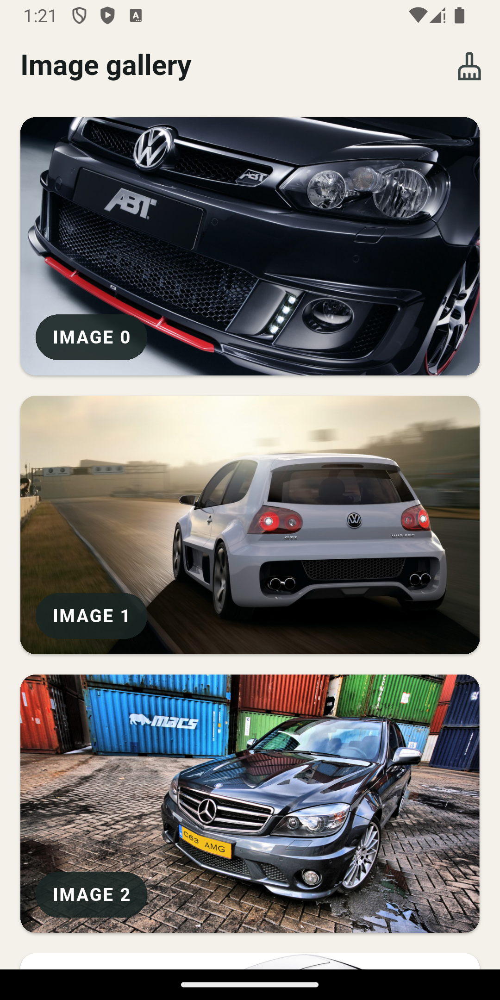
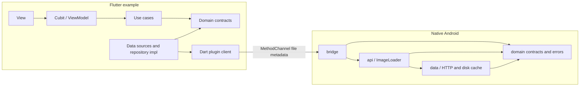

# Native Image Cache for Flutter (Android)

`image_cache_plugin` is an Android-only Flutter plugin and example app built around a native Kotlin image downloader and persistent disk cache. It exposes file metadata to Dart, provides Kotlin and Java host APIs, and demonstrates the integration in a responsive MVVM/Cubit gallery with clean layer boundaries.

<p align="center">
  
</p>

## At a glance

| Area | Implementation |
| --- | --- |
| Platform | Android API 24+; example targets and compiles with SDK 36 |
| Stack | Flutter 3.41.9, Dart 3.11.5, Kotlin 2.2.20, Java 17 |
| Cache | Persistent native files with a four-hour TTL |
| Flutter boundary | MethodChannel returns `path`, `source`, and commit time, never encoded bytes |
| Example architecture | MVVM with Cubit ViewModels and data/domain/presentation layers |
| Networking and images | Platform `HttpURLConnection`, files, and Android/Flutter decoders; no image or network SDK |

## Requirement mapping

| Requirement | Where it is addressed |
| --- | --- |
| Download remote images natively | Kotlin streams HTTP(S) responses with bounded size, timeout, redirect, resource-closing, and cancellation handling. |
| Cache images for four hours | Disk entries persist under app storage; freshness is calculated from the successful commit timestamp. |
| Avoid duplicate work | Same-URL requests coalesce process-wide while different URLs may proceed concurrently. |
| Support invalidation | Per-URL eviction and full clear use generations so older in-flight work cannot restore invalidated entries. |
| Expose the loader to Flutter | A small MethodChannel contract transfers file metadata; Dart validates the dynamic response and renders a `FileImage`. |
| Support native consumers | `ImageLoader` offers Kotlin suspend functions, Java callbacks, cancellable requests, placeholders, and `ImageView` target replacement. |
| Demonstrate app architecture | The example separates data, domain, presentation, use cases, repositories, and constructor-injected Cubit ViewModels. |
| Display the supplied gallery robustly | The UI shows IDs, loading/error states, per-image failures, retry, and cache clear in a responsive single-column list. |

## Demo

<p align="center">
  <a href="screenshots/video.mp4">
    
  </a>
</p>
<p align="center">
  <a href="screenshots/video.mp4"><strong>Open the full 38-second Android demo (MP4)</strong></a>
</p>

## Reviewer quick path

1. [`DiskImageRepository`](android/src/main/kotlin/com/tieorange/image_cache_plugin/data/DiskImageRepository.kt): persistence, four-hour freshness, SHA-256 keys, temporary files, validation, atomic unique commits, recovery, eviction, and clear.
2. [`CacheCoordinator`](android/src/main/kotlin/com/tieorange/image_cache_plugin/data/CacheCoordinator.kt): process-wide URL locks, generations, active temporary identities, and mutation coordination.
3. [`HttpImageDownloader`](android/src/main/kotlin/com/tieorange/image_cache_plugin/data/HttpImageDownloader.kt): bounded streaming, URL and redirect policy, timeouts, cancellation, and connection cleanup.
4. [`ImageLoader`](android/src/main/kotlin/com/tieorange/image_cache_plugin/api/ImageLoader.kt): public Kotlin/Java facade, lifecycle-owned scope, sampled decoding, memory cache, and reused-target safety.
5. [`ImageCachePlugin`](android/src/main/kotlin/com/tieorange/image_cache_plugin/bridge/ImageCachePlugin.kt): Flutter lifecycle, exactly-once result guards, main-thread delivery, stable errors, and detach cancellation.
6. [`MethodChannelImageCacheClient`](lib/src/image_cache_client.dart): typed Dart boundary, result validation, and native error translation.
7. [`NativeCachedImage`](lib/src/native_cached_image.dart): file-backed rendering, placeholder/error behavior, URL changes, disposal, and stale-result protection.
8. [`ImageGalleryPage`](example/lib/features/image_gallery/presentation/pages/image_gallery_page.dart), [`ImageGalleryCubit`](example/lib/features/image_gallery/presentation/cubit/image_gallery_cubit.dart), and [`GalleryRepositoryImpl`](example/lib/features/image_gallery/data/repositories/gallery_repository_impl.dart): responsive UI, MVVM state transitions, and `Either` failure mapping across clean layers.

## Quick start

Prerequisites:

- Flutter 3.41.9 stable and Dart 3.11.5.
- Android SDK 36; Android API 24 or newer device/emulator.
- Java 17.
- Android Gradle Plugin 8.11.1 and Kotlin 2.2.20 are configured by the project.

From the repository root:

```bash
flutter pub get
dart format --output=none --set-exit-if-changed .
flutter analyze
flutter test
flutter pub publish --dry-run
```

From `example/`:

```bash
flutter pub get
flutter analyze
flutter test
flutter run
flutter build apk --debug
flutter build apk --release
```

Run native unit and Java API compile tests from `example/android/`:

```bash
./gradlew testDebugUnitTest
```

All checks are local; the repository does not use GitHub Actions.

## Architecture



- Flutter embedding imports are confined to the native `bridge` package.
- Native `api` and `data` depend on native `domain`, not on Flutter types.
- Example presentation depends on use cases; data implements domain contracts.
- The example domain has no widgets, `dart:io`, MethodChannel, or service locator dependency.
- `get_it` is used only in the [composition root](example/lib/core/di/service_locator.dart); feature dependencies use constructors.

The final UI is a responsive, centered single-column list capped at 720 logical pixels. Each tile displays in a 16:9 viewport with `BoxFit.cover`; only `cacheWidth` is supplied to Flutter decoding, so the source decode ratio is preserved rather than forcing both decode dimensions.

## Core implementation decisions

### Paths, not bytes

Native code returns a committed file path, cache source, and timestamp. Keeping encoded images off MethodChannel avoids copying large payloads through platform serialization, while Flutter can use its normal file-backed image pipeline.

### Atomic, unique commits

Downloads stream into same-directory temporary files and are validated before commit. Under the mutation mutex, the repository checks invalidation generations, allocates the commit timestamp and UUID, then atomically renames the file. A refresh therefore receives a new path and cannot reuse stale Flutter `FileImage` identity.

### Process-wide coordination

A registry keyed by canonical cache-root path shares URL mutexes, URL/global generations, active temporary files, and a mutation mutex across loader instances. Same-URL requests coalesce; eviction, clear, recovery, and pruning cannot be undone by older in-flight work. Different URLs are not serialized during download.

### Typed error flow

Native data failures become typed `ImageLoaderException` values, the bridge maps them to stable channel codes, Dart converts those codes to `ImageCacheException`, and the example repository maps expected data exceptions into domain `Failure` values returned with `Either`.

## Usage

### Dart

```dart
final cache = ImageCachePlugin();
final file = await cache.loadImage('https://example.com/image.jpg');
print('${file.path} ${file.source} ${file.cachedAtMilliseconds}');

await cache.evictImage('https://example.com/image.jpg');
await cache.clearCache();
```

For rendering, `NativeCachedImage` uses the same injectable client boundary:

```dart
NativeCachedImage(
  url: 'https://example.com/image.jpg',
  width: 240,
  placeholder: const CircularProgressIndicator(),
  errorBuilder: (context, error) => const Icon(Icons.broken_image_outlined),
)
```

### Kotlin

Retain one loader for the owning lifecycle. Suspend APIs perform blocking work off the main thread; target registration and `close()` require the main thread.

```kotlin
val loader = ImageLoader(this)

lifecycleScope.launch {
    val file = loader.load(url)
}

val request = loader.loadInto(url, imageView, placeholder = null)

override fun onDestroy() {
    request.cancel()
    loader.close()
    super.onDestroy()
}
```

### Java

Java callers receive callbacks on the main thread rather than interacting with Kotlin continuations.

```java
ImageLoader loader = new ImageLoader(this);
ImageRequest request = loader.load(url, new ImageLoaderCallback() {
  @Override public void onSuccess(CachedImageFile file) { }
  @Override public void onError(Exception error) { }
});

request.cancel();
loader.close(); // Main thread, at lifecycle end.
```

Reusing an `ImageView` supersedes its previous request. Native target loads also support Drawable or resource placeholders and an optional `ImageTargetCallback`.

## MethodChannel contract

Channel: `com.tieorange.image_cache_plugin/methods`

| Method | Arguments | Success result |
| --- | --- | --- |
| `loadImage` | `{url: String}` | `{path: String, source: network\|disk, cachedAtMilliseconds: int}` |
| `evictImage` | `{url: String}` | `null` |
| `clearCache` | none | `null` |

| Error code | Meaning |
| --- | --- |
| `invalid_argument` | Missing, malformed, or unsupported URL |
| `network_error` | Connection, redirect, timeout, or encoded-size failure |
| `http_error` | Non-success HTTP status |
| `cache_error` | Cache directory, file, or commit failure |
| `invalid_image` | Unsupported or excessive decoded image dimensions |
| `cancelled` | Request invalidation or plugin lifecycle cancellation |
| `internal_error` | Unexpected native failure |

Each call has an atomic completion guard. On detach, the bridge stops accepting work, settles pending calls with `cancelled` while the binding is valid, cancels owned work, and ignores late completions.

## Testing and evidence

Focused automated coverage includes:

- [Native cache tests](android/src/test/kotlin/com/tieorange/image_cache_plugin/data/DiskImageRepositoryTest.kt): persistence/reopen, expiry refresh, cross-instance same-URL coalescing, invalidation races, future timestamps, and failure cleanup.
- [Native downloader tests](android/src/test/kotlin/com/tieorange/image_cache_plugin/data/HttpImageDownloaderTest.kt): bounded streaming and cancellation cleanup.
- [Java compile test](android/src/test/java/com/tieorange/image_cache_plugin/api/ImageLoaderJavaCompileTest.java): Java-facing API interoperability.
- [Dart channel tests](test/method_channel_image_cache_client_test.dart): valid metadata, malformed metadata, and typed error mapping.
- [Plugin widget tests](test/native_cached_image_test.dart): placeholder, success, error, and stale asynchronous completion.
- [Example tests](example/test): repository failure mapping, remote parsing, Cubit transitions, dependency graph, and one representative gallery interaction.

There is no dedicated automated bridge lifecycle test; detach and exactly-once behavior are implemented in the bridge and remain a focused testing gap rather than a claimed result.

Recorded device acceptance:

| Environment | Evidence |
| --- | --- |
| Physical Pixel, Android API 29 | Release APK built, installed, and launched successfully. |
| Android emulator, API 34 | Live list and IDs loaded; valid images rendered with isolated item failure; relaunch reused fresh persisted entries; clear caused subsequent downloads to receive new paths. |

Manual acceptance requires network access and availability of the live endpoint. Unit and widget tests use controlled boundaries and do not require live network access.

## Dependencies

| Scope | Dependency | Rationale |
| --- | --- | --- |
| Native runtime | Kotlin Coroutines 1.11.0 | Structured IO, cancellation, coalescing, and main-thread delivery |
| Example | `flutter_bloc` 9.1.1 | Cubit ViewModels and explicit state transitions |
| Example | `fpdart` 1.2.0 | Expected failures represented as `Either` |
| Example | `get_it` 9.2.1 | Composition-root-only dependency assembly |
| Example | `equatable` 2.1.0 | Value equality for entities, failures, and states |
| Tests | JUnit Jupiter, Coroutines Test, Mockito-Kotlin, Mocktail, `bloc_test` | Focused native, boundary, widget, repository, and state tests |

The Dart plugin runtime depends only on Flutter. Native networking uses `HttpURLConnection` and persistence uses files; Glide, Coil, Picasso, OkHttp, Retrofit, Room, and equivalent image/network/persistence SDKs are intentionally absent.

## Known limitations and tradeoffs

- Android is the only supported Flutter platform.
- Coordination is process-wide, not cross-process.
- Disk usage has no size-based LRU policy; cleanup is TTL-driven or explicit.
- The gallery JSON is not persisted, so an offline cold start cannot discover cached image entries.
- The example and manual flow depend on the live endpoint and its expected schema.
- HTTP behavior does not include authentication, conditional requests, or cache-control negotiation.
- The example release build uses debug signing for local installation, not production distribution.
- Sampled native `ImageView` decoding uses an in-process memory cache; Flutter rendering uses its separate `FileImage` pipeline.

Likely production extensions are a disk-size policy, cross-process locking, persisted gallery metadata, authenticated request configuration, conditional revalidation, and dedicated bridge lifecycle tests.
